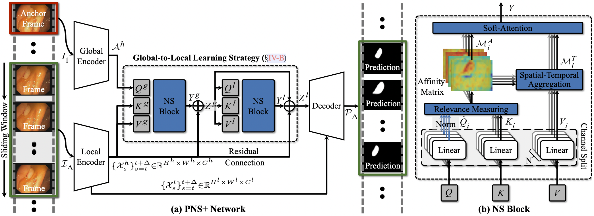
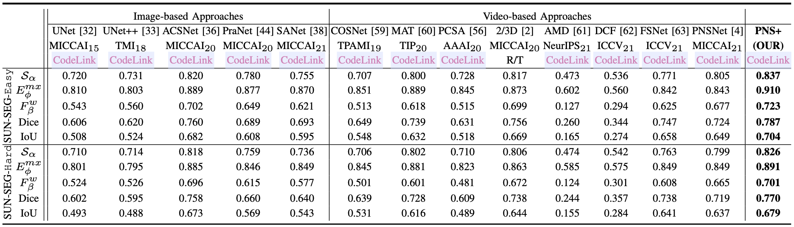
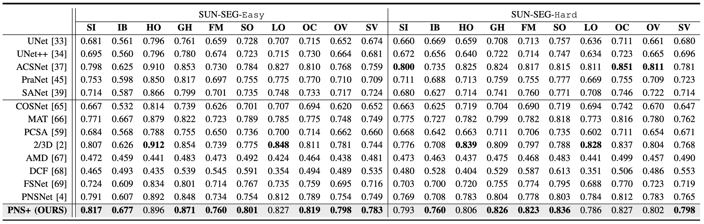

# <p align=center>`Video Polyp Segmentation: A Deep Learning Perspective (MIR 2022)`</p><!-- omit in toc -->

[](https://opensource.org/licenses/MIT)


[](https://arxiv.org/pdf/2203.14291v3.pdf)
[](https://gitter.im/video-polyp-segmentation/community?utm_source=badge&utm_medium=badge&utm_campaign=pr-badge)
[](https://paperswithcode.com/sota/video-polyp-segmentation-on-sun-seg-easy?p=video-polyp-segmentation-a-deep-learning)
[](https://paperswithcode.com/sota/video-polyp-segmentation-on-sun-seg-hard?p=video-polyp-segmentation-a-deep-learning)


> [!note]
> Regarding large volume of data requests recently, due to the original website of SUN-database (http://amed8k.sundatabase.org/) is no longer maintained. Suggest you emailing me at gepengai.ji@gmail.com for alternative access options.
>
> We're currently pushing intelligent colonoscopy into the multimodal era. Recommen you reading two research works from our team:
> - :boom: The pioneering multimodal analysis solution for colonoscopy: **ColonINST** & **ColonGPT** ([paper](https://arxiv.org/abs/2410.17241) & [project page](https://github.com/ai4colonoscopy/IntelliScope))
> - :boom: The current largest multimodal dataset **ColonVQA (1.1+ million entries)** in colonoscopy. We also introduce the first reasoning-centric dataset **ColonReason**, along with an R1-styled model, **ColonR1**, tailored for colonoscopy tasks. ([paper](https://arxiv.org/abs/2512.03667) & [project page](https://github.com/ai4colonoscopy/Colon-X))


<p align="center">
     <br />
</p>

- **Title:** Video Polyp Segmentation: A Deep Learning Perspective (accepted by Machine Intelligence Research, please see [arXiv version](https://arxiv.org/pdf/2203.14291v3.pdf) & [Spriner version](https://link.springer.com/article/10.1007/s11633-022-1371-y))
- **Authors:** [Ge-Peng Ji](https://scholar.google.com/citations?view_op=list_works&hl=en&hl=en&user=oaxKYKUAAAAJ)^, [Guobao Xiao](https://guobaoxiao.github.io)^, [Yu-Cheng Chou](https://sites.google.com/view/yu-cheng-chou)^, [Deng-Ping Fan](https://dengpingfan.github.io/)*, [Kai Zhao](https://kaizhao.net/), [Geng Chen](https://scholar.google.com/citations?user=sJGCnjsAAAAJ&hl=en), and [Luc Van Gool](https://scholar.google.com/citations?user=TwMib_QAAAAJ&hl=en).
- **Contact:** We invite all to contribute to making it more accessible and useful. If you have any questions, please feel free to drop us an e-mail (gepengai.ji@gmail.com & dengpfan@gmail.com) or directly report the issue or push a PR. Your star is our motivation, let's enjoy it!
- Welcome any discussions on video polyp segmentation at [Gitter room](https://gitter.im/video-polyp-segmentation/community?utm_source=share-link&utm_medium=link&utm_campaign=share-link) or join our [WeChat group](https://github.com/GewelsJI/VPS/blob/main/assets/wechat_group_qr_code_20240816.JPG).
- The following is a video to quickly access the core points of our work.

https://github.com/GewelsJI/VPS/assets/38354957/9bea01ae-9582-494f-8bf6-f83307eebc08

# Contents<!-- omit in toc -->
- [1. Features](#1-features)
- [2. News](#2-news)
- [3. VPS Dataset](#3-vps-dataset)
- [4. VPS Baseline](#4-vps-baseline)
- [5. VPS Benchmark](#5-vps-benchmark)
- [6. Tracking Trends](#6-tracking-trends)
- [7. Citations](#7-citations)
- [8. FAQ](#8-faq)
- [9. License](#9-license)
- [10. Acknowledgments](#10-acknowledgments)


# 1. Features

In the deep learning era, we present the first comprehensive video polyp segmentation (VPS) study. Over the years, developments on VPS have not moved forward with ease since large-scale fine-grained segmentation masks are still not made publicly available. To tackle this issue, we first introduce a long-awaited high-quality per-frame annotated VPS dataset. There are four features of our work:

- **VPS Dataset:** We recognize the importance of annotated medical data for substantial progress in research on medical AI systems’ development. Thus, our SUN-SEG dataset is open access, a non-profit database of the high-quality, large-scale, densely annotated dataset for facilitating colonoscopy diagnosis, localization, and derivative tasks. Our vision aims to provide data and knowledge to aid and educate clinicians, and also for the development of automated medical decision support systems.
- **VPS Baseline:** We propose a simple but efficient baseline, which outperforms the 13 cutting-edge polyp segmentation approaches and runs in super real-time (170fps). We hope such a baseline could attract more researchers to join our community and inspire them to develop more interesting solutions.
- **VPS Benchmark:** For a fair comparison, we build an online leaderboard to keep up with the new progress of the VPS community. Besides, we provide an out-of-the-box evaluation toolbox for the VPS task.
- **Tracking Trends:** We elaborately collect a paper reading list ( :boom: [Awesome Paper List](https://github.com/GewelsJI/VPS/blob/main/docs/AWESOME_VPS.md) :boom: ) to continuously track the latest updates in this rapidly advancing field.


# 2. News
- *[Jul/15/2024]* Thanks to [@Yuli Zhou](https://github.com/zhoustan) for raising up the frame sorting issues in the inference and evaluation code (check out the pull request here: https://github.com/GewelsJI/VPS/pull/48). It turns out it only slightly impacted our final evaluation performance (check out the evidence [here](https://github.com/GewelsJI/VPS/blob/main/docs/RELEASE_NOTES.md)).
- *[Oct/26/2023]* The video-level attributes have released at [Google Drive](https://docs.google.com/spreadsheets/d/1J33EvrEcZp5CMWtKN_4VNdhp4EQsjMSf/edit?usp=sharing&ouid=117958307137184272405&rtpof=true&sd=true).
- *[Jan/30/2023]* We update the bounding box annotation with COCO-like format, ie, `[x,y,width,height]` where x and y are the upper-left coordinates of the bounding box. Please download the latest compressed file at [here](https://github.com/GewelsJI/VPS/blob/main/docs/DATA_PREPARATION.md#step-1-request-and-download). Thanks for Yingling Lu for pointing out this issue.
- *[August/24/2022]* :boom: Our paper has been accepted by [Machine Intelligence Research (MIR)](https://www.springer.com/journal/11633) journal.
- *[July/03/2022]* :boom: We update a new version of SUN-SEG with more fine-grained data splits, including seen/unseen scenarios. For more details refer to our technical report. Also, the new PaperWithCode page refers to [SUN-SEG-Easy](https://paperswithcode.com/dataset/sun-seg-easy) & [SUN-SEG-Hard](https://paperswithcode.com/dataset/sun-seg-hard).
- *[May/11/2022]* Release rejected labels: [SUN-SEG-Rejected-Labels (Google Drive, 120.7MB)](https://drive.google.com/file/d/1OtK2PR6gKQv56dIFjw0rXadcgGonf93S/view?usp=sharing). For more details see [here](https://github.com/GewelsJI/VPS/blob/main/docs/DATA_DESCRIPTION.md#rejected-labels).
- *[March/27/2022]* Release pretrained checkpoints and whole benchamrks results.
- *[March/18/2022]* Upload the whole training/testing code for our enhanced model PNS+.
- *[March/15/2022]* Release the evaluation toolbox for the VPS task. Add a [Awesome_Video_Polyp_Segmentation.md](https://github.com/GewelsJI/VPS/blob/main/docs/AWESOME_VPS.md) for tracking latest trends of this community.
- *[March/14/2022]* Create the project page.


# 3. VPS Dataset

<p align="center">
     <br />
    <em> 
    Figure 1: Annotation of SUN-SEG dataset. The object-level segmentation masks in the SUN-SEG dataset of different pathological categories, which is densely annotated with experienced annotators and verified by colonoscopy-related researchers to ensure the quality of the proposed dataset. 
    </em>
</p>

Notably, based on some necessary privacy-preserving considerations from the SUN dataset, we could not directly share the download link of the video dataset with you without authorization. And please inform us of your institution and the purpose of using SUN-SEG in the email. Thank you for your understanding! 

- How to get access to our SUN-SEG dataset? Please refer to [`DATA_PREPARATION`](https://github.com/GewelsJI/VPS/blob/main/docs/DATA_PREPARATION.md).
- If you wanna know more descriptions about our SUN-SEG dataset. Please refer to our [`DATA_DESCRIPTION.md`](https://github.com/GewelsJI/VPS/blob/main/docs/DATA_DESCRIPTION.md).


# 4. VPS Baseline

> This work is the extension version of our conference paper (Progressively Normalized Self-Attention Network for Video Polyp Segmentation) accepted at MICCAI-2021. More details could refer to [arXiv](https://arxiv.org/abs/2105.08468) and [Github Link](https://github.com/GewelsJI/PNS-Net)


<p align="center">
     <br />
    <em> 
    Figure 2: The pipeline of the proposed (a) PNS+ network, which is based on (b) the normalized self-attention (NS) block.
    </em>
</p>


There are three simple-to-use steps to access our project code (PNS+):

- Prerequisites of environment: 

  ```bash
    conda create -n PNS+ python=3.6
    conda activate PNS+
    conda install pytorch=1.1.0 torchvision -c pytorch
    pip install tensorboardX tqdm Pillow==6.2.2
    pip install git+https://github.com/pytorch/tnt.git@master
    ```

- Compiling the project:
    ```bash
    cd ./lib/module/PNS
    python setup.py build develop
    ```
- Training:

    ```bash
    python ./scripts/my_train.py
    ```

- Testing:
    
    Downloading pre-trained weights and move it into `snapshot/PNSPlus/epoch_15/PNSPlus.pth`, 
    which can be found in this download link: [Google Drive, 102.9MB](https://drive.google.com/file/d/1YCC9AiSr3yMhPXBEnM2bgjoJ7fodpLkK/view?usp=sharing) / [Baidu Drive](https://pan.baidu.com/s/1mnd9GD2BiWFzsibv7WiwAA) (Password: g7sa, Size: 108MB).
    ```bash
    python ./scripts/my_test.py
    ```


# 5. VPS Benchmark

We provide an out-of-the-box evaluation toolbox for the VPS task, which is written in Python style. You can just run it to generate the evaluation results on your custom approach. Or you can directly download the complete VPS benchmark including the prediction map of each competitor at the download link: [Google Drive, 5.45GB](https://drive.google.com/file/d/1Liva1oR1-1ihWaTNNM5WDKZVETAF587M/view?usp=sharing) / [Baidu Drive](https://pan.baidu.com/s/1Qu-0l9w0ja92nzrlWMRhoQ) (Password: 2t1l, Size: 5.45G).

- More instructions about **Evaluation Toolbox** refer to [`PageLink`](https://github.com/GewelsJI/VPS/tree/main/eval).

We also built an online leaderboard to keep up with the new progress of other competitors. We believe this is a fun way to learn about new research directions and stay in tune with our VPS community.

- Online leaderboard is publicly avaliable at PaperWithCode: [SUN-SEG-Easy](https://paperswithcode.com/dataset/sun-seg-easy) & [SUN-SEG-Hard](https://paperswithcode.com/dataset/sun-seg-hard).

Here, we present a variety of qualitative and quantitative results of VPS benchmarks:


- Visual prediction of top-performance competitors:

<p align="center">
     <br />
    <em> 
    Figure 3: Qualitative comparison of three video-based models (PNS+, PNSNet, and 2/3D) and two image-based models (ACSNet, and PraNet).  
    </em>
</p>

- Model-based performance:

<p align="center">
     <br />
    <em> 
    Figure 4: Quantitative comparison on two testing sub-datasets, i.e., SUN-SEG-Easy (Unseen) and SUN-SEG-Hard (Unseen). `R/T' represents we re-train the non-public model, whose code is provided by the original authors. The best scores are highlighted in bold.
    </em>
</p>

- Attribute-based performance:

<p align="center">
     <br />
    <em>  
    Figure 5: Visual attributes-based performance on our SUN-SEG-Easy (Unseen) and SUN-SEG-Hard (Unseen) in terms of structure measure.
    </em>
</p>


# 6. Tracking Trends

<p align="center">
     <br />
</p>

To better understand the development of this field and to quickly push researchers in their research process, we elaborately build a **Paper Reading List**. It includes **119** colonoscopy imaging-based AI scientific research in the past 12 years. It includes several fields, such as image polyp segmentation, video polyp segmentation, image polyp detection, video polyp detection, and image polyp classification. Besides, we will provide some interesting resources about human colonoscopy. 

> **Note:** If we miss some treasure works, please let me know via e-mail or directly push a PR. We will work on it as soon as possible. Many thanks for your active feedback.

- The latest paper reading list and some interesting resources refer to [`Awesome-Video-Polyp-Segmentation.md`](https://github.com/GewelsJI/VPS/blob/main/docs/AWESOME_VPS.md)


# 7. Citations

If you have found our work useful, please use the following reference to cite this project:

    @article{ji2022video,
      title={Video polyp segmentation: A deep learning perspective},
      author={Ji, Ge-Peng and Xiao, Guobao and Chou, Yu-Cheng and Fan, Deng-Ping and Zhao, Kai and Chen, Geng and Van Gool, Luc},
      journal={Machine Intelligence Research},
      volume={19},
      number={6},
      pages={531--549},
      year={2022},
      publisher={Springer}
    }


    @inproceedings{ji2021progressively,
      title={Progressively normalized self-attention network for video polyp segmentation},
      author={Ji, Ge-Peng and Chou, Yu-Cheng and Fan, Deng-Ping and Chen, Geng and Fu, Huazhu and Jha, Debesh and Shao, Ling},
      booktitle={International Conference on Medical Image Computing and Computer-Assisted Intervention},
      pages={142--152},
      year={2021},
      organization={Springer}
    }

    @inproceedings{fan2020pranet,
      title={Pranet: Parallel reverse attention network for polyp segmentation},
      author={Fan, Deng-Ping and Ji, Ge-Peng and Zhou, Tao and Chen, Geng and Fu, Huazhu and Shen, Jianbing and Shao, Ling},
      booktitle={International conference on medical image computing and computer-assisted intervention},
      pages={263--273},
      year={2020},
      organization={Springer}
    }
# 8. FAQ

- Thanks to [Tuo Wang](victor_wt@qq.com) for providing a great solution to [upgrade the CUDA version when compiling the NS block](./docs/Upgrade%20environment%20for%20NS%20block.pdf).

# 9. License

The dataset and source code is free for research and education use only. Any commercial usage should get formal permission first.

- **Video Source:** SUN (Showa University and Nagoya University) Colonoscopy Video Database is the colonoscopy video database for the evaluation of automated colorectal-polyp detection. The database comprises still images of videos, which are collected at the Showa University Northern Yokohama Hospital. Mori Laboratory, Graduate School of Informatics, Nagoya University developed this database. Every frame in the database was annotated by the expert endoscopists at Showa University.

- **Intended Use:** This database is available for only non-commercial use in research or educational purposes. 
As long as you use the database for these purposes, you can edit or process images and annotations in this database. 
Without permission from Mori Lab., commercial use of this dataset is prohibited even after copying, editing, 
processing, or any operations of this database. Please contact us for commercial use or if you are uncertain about
the decision.

- **Distribution:** It is prohibited to sell, transfer, lend, lease, resell, distribute, etc., as it is, or copy, edit, or process this database, in whole or in part.


# 10. Acknowledgments

- Our dataset is built upon the SUN (Showa University and Nagoya University) Colonoscopy Video Database, Thanks very much for their wonderful work!
- This codebase is based on our conference version [PNSNet](https://github.com/GewelsJI/PNS-Net), which is accepted by the MICCAI-2021 conference.
