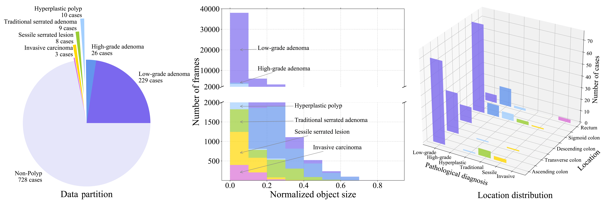
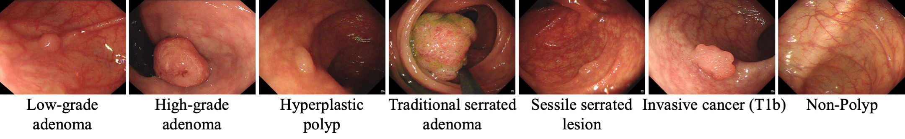

# SUN-SEG Dataset Description

<p align="center">
     <br />
</p>

Our SUN-SEG dataset including 49,136 polyp frames (i.e., postive part) and 109,554 non-polyp frames (i.e., negative part) taken from  different 285 and 728 colonoscopy videos clips, which were densely annotated with diversified labels for each frame, such as object-level segmentation mask, bounding box, category, attribute, and three weak label (ie. edge, scribble , 
polygon). More details refer to SUN dataset: http://sundatabase.org/

## Data Format

```
├──data
    ├──SUN-SEG
        ├──TrainDataset
            ├──Frame  # The images from SUN dataset
                ├──case1_1
                    ├──image_name_00001.jpg
                    |...
                ├──case1_3
                |...
            ├──GT  # Object-level segmentation mask
                ├──case1_1
                    ├──image_name_00001.png
                    |...
                ├──case1_3
                |...
            ├──Edge  # object-level segmentation mask
                |...
            ├──Scribble  # Weak label with scribble
                |...
            ├──Polygon  # Weak label with Polygon
                |...
            ├──Classification  # Category classification annotation
                ├──classification.txt
            ├──Detection  # Bounding box
                ├──bbox_annotation.json
        ├──TestEasyDataset
            ├──Frame
                ├──case2_3
                |...
            ├──GT
                ├──case2_3
                |...
            |...
        ├──TestHardDataset
            ├──Frame
                ├──case1_2
                |...
            ├──GT
                ├──case1_2
                |...
            |...
```

The `Frame` folder contains the frames and the rest folders contain the corresponding ground truth. 
As for the `bbox_annotation.json` and `classfication.txt` text file, we follow the same format as COCO and ImageNet for generality.

## Dataset Statistics

<p align="center">
     <br />
</p>

### Positive Part

- The positive part of SUN-SEG has 285 video clips (30 fps), which has 49,136 frames totally.

- More details of each polyp video clips refer to [`INFO_POSITIVE_CASES.md`](https://github.com/GewelsJI/VPS/blob/main/docs/INFO_POSITIVE_CASES.md).

### Negative Part

- The negative part of SUN-SEG has 728 video clips (30 fps), which has 109,554 frames totally.

- More details of each non-polyp video clips refer to [`INFO_NEGATIVE_CASES.md`](https://github.com/GewelsJI/VPS/blob/main/docs/INFO_NEGATIVE_CASES.md)

## Label Description

### Label-I: Category Classification Annotation

<p align="center">
     <br />
</p>

Here are seven classes of pathological diagnosis:

- Low-grade adenoma (229 videos, 39834 frames)
- High-grade adenoma (26 videos, 4111 frames)
- Hyperplastic polyp (10 videos, 1644 frames)
- Traditional serrated adenoma (9 videos, 1627 frames)
- Sessile serrated lesion (8 videos, 1288 frames)
- Invasive carcinoma (3 videos, 632 frames)
- Non-Polyp (728 videos, 109,554 frames)

The annotation is in `./data/DATASET/classification.txt`. 
In the text file, each row represents a image and its class of pathological diagnosis. 
Here are an example:

    image_dir_00001.jpg	low_grade_adenoma
    image_dir_00002.jpg	hyperplastic_polyp
    image_dir_00003.jpg	sessile_serrated_lesion
    ...

### Label-II: Object-level Segmentation Mask

<p align="center">
     <br />
</p>

In polyp-existing frames, each polyp is annotated with a segmentation mask as shown above. 

The annotation is in `./data/DATASET/GT/`. Each image's name has direct correspondance with the annotation file name. 
For example, the segmentation mask for `image_dir_00001.jpg` is `image_dir_00001.png`.

### Label-III: Bounding Box

<p align="center">
     <br />
</p>

We present the bounding box annotation for each polyp-existing frame. 
In `./data/DATASET/bbox_annotation.json` file, we follow the same format as COCO dataset. 

Here are an example:

```
{
    'info': {
        'year': 2021, 
        'version': 'v1.0', 
        'description': 'SUN Colonoscopy Video Database. Hayato et al, 2020.', 
        'contributor': '', 
        'url': '', 
        'date_created': ''}, 
    'images': [{
        'id': 'case1_1-a2-image0001', 
        'width': 1158, 
        'height': 1008,
        'case_name': 'case1_1'  # case_name means the name of case in the folder.
        'file_name': 'case_M_20181001100941_0U62372100109341_1_005_001-1_a2_ayy_image0001'}, # file_name is corresponding to the image name in the folder. 
        ...], 
    'annotation': [{
        'id': 'case1_1-a2-image0001', 
        'bbox': [262, 72, 68, 81]},  # Each element represnets the [min_x, min_y, max_x, max_y].
        ...]
}

```

### Label-IV: Weak-labels with Edge/Polygon/Scribble

<p align="center">
     <br />
</p>

We present the scribble/polygon label for each polyp-existing frame.

The annotation is in `./data/DATASET/Edge/`, `./data/DATASET/Scribble/`, and `./data/DATASET/Polygon/`, respectively. Each image's name has direct correspondance with the annotation file name. 
For example, the label for `image_dir_00001.jpg` is `image_dir_00001.png`.

For each test image, predict the object mask or bounding boxes.
The evaluation is conducted with the segmentation mask in `./GT/` or the bounding boxes in `./bbox_annotation.json` respectively.

## Attributes Description

Next, we provide the complete attributes for our SUN-SEG dataset.

- **Pathological Patterns**

| ID   | Name                         | Description                                                                                                                                                                                   |
| ---- | ---------------------------- |-----------------------------------------------------------------------------------------------------------------------------------------------------------------------------------------------|
| LA   | Low-grade adenoma            | The polyp with low-grade dysplasia often show nuclear changes, such as palisading and darkening of the nucleus.                                                                               |
| HA   | High-grade adenoma           | The polyp with high-grade dysplasia, which has more severe cellular and nuclear changes.                                                                                                      |
| HP   | Hyperplastic polyp           | The polyp has small vessels or sparse network, with unrecognizable pattern and is lighter than or similar to the surroundings.                                                                |
| TSA  | Traditional serrated adenoma | A neoplastic polyp characterised by eosinophilic cells, ectopic crypt formations and slit-like epithelial serrations.                                                                         |
| SSL  | Sessile serrated lesion      | A neoplastic polyp characterised by serrated architectural features and lack of cytological dysplasia.                                                                                        |
| IC   | Invasive cancer (T1b)        | Its color is darker than the surroundings, brownish, sometimes with lighter patches. The vessel of areas with interrupted or absent vessels. The surface is amorphous ofr no surface pattern. |
| SI   | Surgical Instruments         | The endoscopic surgical procedures involving positioning of instruments, such as snares, forceps, knives and electrodes.                                                                      |

- **Shape**

> We follow the Narrow Band Imaging International Colorectal Endoscopic (NICE) classification criteria. It uses staining, vascular patterns, and surface patterns to distinguish between hyperplastic and adenomatous colon polyps. More details refer to [link-1](https://www.endoscopy-campus.com/en/classifications/polyp-classification-nice/) and [link-2](https://www.ncbi.nlm.nih.gov/pmc/articles/PMC5369434/)

| ID   | Name                         | Description                                                                                                                                                                                   |
| ---- | ---------------------------- |-----------------------------------------------------------------------------------------------------------------------------------------------------------------------------------------------|
| Ip   | Pedunculated                 | Base is more narrow that top of lesion.                                                                                                                                                       |
| Isp  | Subpedunculated              | Intermediate and broad-based. Same management as (0-Is) sessile polyps.                                                                                                                       |
| Is   | Sessile                      | Base and top of lesion have same diameter.                                                                                                                                                    |
| IIa  | Slightly elevated            | Lesion is slightly higher than adjacent mucosa.                                                                                                                                               |

- **Location**

| ID   | Name                         | Description                                                                                                                                                                                   |
| ---- | ---------------------------- |-----------------------------------------------------------------------------------------------------------------------------------------------------------------------------------------------|
| C    | Cecum                        | Lesion is located in Cecum.                                                                                                                                                                   |
| A    | Ascending colon              | Lesion is located in Ascending colon.                                                                                                                                                         |
| T    | Transverse colon             | Lesion is located in Transverse colon.                                                                                                                                                        |
| D    | Descending colon             | Lesion is located in Descending colon.                                                                                                                                                        |
| S    | Sigmoid colon                | Lesion is located in Sigmoid colon.                                                                                                                                                           |
| R    | Rectum                       | Lesion is located in Rectum.                                                                                                                                                                  |

- **Visual Attributes**

| ID   | Name                         | Description                                                                                                                                      |
| ---- | ---------------------------- |--------------------------------------------------------------------------------------------------------------------------------------------------|
| IB   | Indefinable Boundaries       | The foreground and background areas around the object have similar color.                                                                        |
| HO   | Heterogeneous Object         | Object regions have distinct colors.                                                                                                             |
| GH   | Ghosting                     | Object has anomaly RGB-colored boundary due to fast moving or insufficient refresh rate.                                                         |
| FM   | Fast-Motion                  | The average per-frame object motion, computed as the Euclidean distance of polyp centroids between consecutive frames, is larger than 20 pixels. |
| SO   | Small Object                 | The average ratio between the object size and the image area is smaller than 0.05.                                                               |
| LO   | Large Object                 | The average ratio between the object bounding-box area and the image area is larger than tlr = 0.15.                                             |
| OCC  | Occlusion                    | Object becomes partially or fully occluded.                                                                                                      |
| OV   | Out-of-view                  | Object is partially clipped by the image boundaries.                                                                                             |
| SV   | Scale-Variation              | The average area ratio among any pair of bounding boxes enclosing the target object is smaller than $0.5$.                                       |


## Reference

- Video Shallow Detection: 
    - https://github.com/eraserNut/ViSha
    - https://erasernut.github.io/ViSha.html
- COCO dataset: https://cocodataset.org/#people
- KITTI dataset: http://www.cvlibs.net/datasets/kitti/index.php