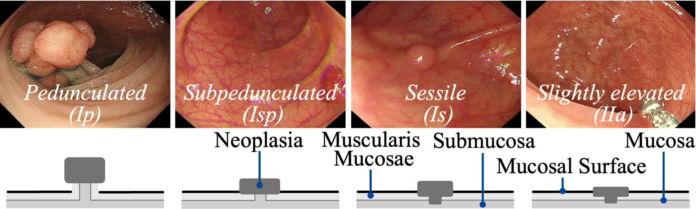

# The Descriptions of SUN-SEG Dataset 

<p align="center">
     <br />
</p>

We first introduce a high-quality per-frame annotated VPS dataset, named SUN-SEG, which includes 158,690 frames from the famous SUN dataset. We extend the labels with diverse types, i.e., object mask, boundary, scribble, polygon, and visual attribute. We also introduce the pathological information from the original [SUN dataset](http://sundatabase.org/), including pathological classification labels, location information, and shape information. 

Notably, the origin SUN dataset has 113 colonoscopy videos, including 100 positive cases with 49, 136 polyp frames and 13 negative cases with 109, 554 non-polyp frames. We manually trim them into 378 positive and 728 negative short clips, meanwhile maintaining their intrinsic consecutive relationship. Such data pre-processing ensures each clip has around 3~11s duration at a real-time frame rate (i.e., 30 fps), which promotes the fault-tolerant margin for various algorithms and devices. To this end, the re-organized SUN-SEG contains 1, 106 short video clips with 158, 690 video frames totally, offering a solid foundation to build a representative benchmark.

As such, it yields the final version of our SUN-SEG dataset, which includes 49,136 polyp frames (i.e., positive part) and 109,554 non-polyp frames (i.e., negative part) taken from different 285 and 728 colonoscopy videos clips, as well as the corresponding annotations. The following sections will provide details about our SUN-SEG point-by-point.

- [The Descriptions of SUN-SEG Dataset](#the-descriptions-of-sun-seg-dataset)
- [File Tree Organization](#file-tree-organization)
- [Dataset Statistics](#dataset-statistics)
  - [Positive Part](#positive-part)
  - [Negative Part](#negative-part)
- [Label Description](#label-description)
  - [Label-I: Category Classification Annotation](#label-i-category-classification-annotation)
  - [Label-II: Object Mask](#label-ii-object-mask)
  - [Label-III: Bounding Box](#label-iii-bounding-box)
  - [Label-IV: Boundary](#label-iv-boundary)
  - [Label-V: Two Weak Labels (Scribble & Polygon)](#label-v-two-weak-labels-scribble--polygon)
  - [Label-VI: Attributes Description](#label-vi-attributes-description)
- [Rejected Labels](#rejected-labels)
- [Citations](#citations)
  - [Reference](#reference)


# File Tree Organization

The `Frame` folder contains the frames and the rest folders contain the corresponding ground truth. As for the `bbox_annotation.json` and `classfication.txt` text files, we follow the same format as COCO and ImageNet for generality.

```
├──data
    ├──SUN-SEG
        ├──TrainDataset
            ├──Frame  # The images from SUN dataset
                ├──case1_1
                    ├──image_name_00001.jpg
                    |...
                ├──case1_3
                |...
            ├──GT  # Object-level segmentation mask
                ├──case1_1
                    ├──image_name_00001.png
                    |...
                ├──case1_3
                |...
            ├──Edge  # Weak label with edge
                |...
            ├──Scribble  # Weak label with scribble
                |...
            ├──Polygon  # Weak label with Polygon
                |...
            ├──Classification  # Category classification annotation
                ├──classification.txt
            ├──Detection  # Bounding box
                ├──bbox_annotation.json
        ├──TestEasyDataset
            ├──Seen
                ├──Frame
                    ├──case2_3
                    |...
                ├──GT
                    ├──case2_3
                    |...
                |...
            ├──Unseen
                ├──Frame
                    ├──case3_1
                    |...
                ├──GT
                    ├──case3_1
                    |...
                |...
        ├──TestHardDataset
            ├──Seen
                ├──Frame
                    ├──case1_2
                    |...
                ├──GT
                    ├──case1_2
                    |...
                |...
            ├──Unseen
                ├──Frame
                    ├──case10_1
                    |...
                ├──GT
                    ├──case10_1
                    |...
                |...
```


# Dataset Statistics

Figure 1 (left) shows the statistic distributions for pathological patterns excluding non-polyp (NP). We find that well-differentiated or low-grade adenoma is dominated but is difficult to locate due to the low-intensity contrast between the lesion and mucosal surface. Figure 1 (right) shows the multi-dependencies among pathological patterns, shape, and location of colon polyp.
    

<p align="center">
     <br />
    <em> 
    Figure 1: (Left) Distribution over pathological patterns. (Right) Multi-dependencies among pathological pattern, shape, and location.
    </em>
</p>


## Positive Part

- The positive part of SUN-SEG has 285 video clips (30 fps), which has 49,136 frames.

- More details of each polyp video clips refer to [`INFO_POSITIVE_CASES.md`](https://github.com/GewelsJI/VPS/blob/main/docs/INFO_POSITIVE_CASES.md).

## Negative Part

- The negative part of SUN-SEG has 728 video clips (30 fps), which has 109,554 frames.

- More details of each non-polyp video clips refer to [`INFO_NEGATIVE_CASES.md`](https://github.com/GewelsJI/VPS/blob/main/docs/INFO_NEGATIVE_CASES.md)


# Label Description

## Label-I: Category Classification Annotation

<p align="center">
     <br />
</p>

Here are seven classes of pathological diagnosis:

- Low-grade adenoma (229 videos, 39834 frames)
- High-grade adenoma (26 videos, 4111 frames)
- Hyperplastic polyp (10 videos, 1644 frames)
- Traditional serrated adenoma (9 videos, 1627 frames)
- Sessile serrated lesion (8 videos, 1288 frames)
- Invasive carcinoma (3 videos, 632 frames)
- Non-Polyp (728 videos, 109,554 frames)

The annotation is in `./data/DATASET/classification.txt`. 
In the text file, each row represents an image and its class of pathological diagnosis. 
Here are an example:

    image_dir_00001.jpg	low_grade_adenoma
    image_dir_00002.jpg	hyperplastic_polyp
    image_dir_00003.jpg	sessile_serrated_lesion
    ...

## Label-II: Object Mask

<p align="center">
     <br />
</p>

In polyp-existing frames, each polyp is annotated with a segmentation mask as shown above. 

The annotation is in `./data/DATASET/GT/`. Each image's name has a direct correspondence with the annotation file name. 
For example, the segmentation mask for `image_dir_00001.jpg` is `image_dir_00001.png`.

## Label-III: Bounding Box

<p align="center">
     <br />
</p>

We present the bounding box annotation for each polyp-existing frame. In `./data/DATASET/bbox_annotation.json` file, we follow the same format as the COCO dataset. Here is an example of COCO-style annotation:

    {
        'info': {
            'year': 2021, 
            'version': 'v1.0', 
            'description': 'SUN Colonoscopy Video Database. Hayato et al, 2020.', 
            'contributor': '', 
            'url': '', 
            'date_created': ''}, 
        'images': [{
            'id': 'case1_1-a2-image0001', 
            'width': 1158, 
            'height': 1008,
            'case_name': 'case1_1'  # case_name means the name of case in the folder.
            'file_name': 'case_M_20181001100941_0U62372100109341_1_005_001-1_a2_ayy_image0001'}, # file_name is corresponding to the image name in the folder. 
            ...], 
        'annotation': [{
            'id': 'case1_1-a2-image0001', 
            'bbox': [262, 72, 68, 81]},  # Each element represnets the [min_x, min_y, width, height].
            ...]
    }

## Label-IV: Boundary

The annotations are stored in `./data/DATASET/Edge/`. Each image's name has a direct correspondence with the annotation file name. 

<p align="center">
     <br />
</p>

## Label-V: Two Weak Labels (Scribble & Polygon)

The annotations are in `./data/DATASET/Scribble/`, and `./data/DATASET/Polygon/`, respectively. Each image's name has a direct correspondence with the annotation file name. 

<p align="center">
     <br />
</p>

## Label-VI: Attributes Description

Next, we provide the complete attributes for our SUN-SEG dataset.

- **Pathological Patterns**

| ID   | Name                         | Description                                                                                                                                                                                   |
| ---- | ---------------------------- |-----------------------------------------------------------------------------------------------------------------------------------------------------------------------------------------------|
| LA   | Low-grade adenoma            | The polyp with low-grade dysplasia often shows nuclear changes, such as palisading and darkening of the nucleus.                                                                               |
| HA   | High-grade adenoma           | The polyp with high-grade dysplasia, which has more severe cellular and nuclear changes.                                                                                                      |
| HP   | Hyperplastic polyp           | The polyp has small vessels or sparse networks, with unrecognizable patterns and is lighter than or similar to the surroundings.                                                                |
| TSA  | Traditional serrated adenoma | A neoplastic polyp characterised by eosinophilic cells, ectopic crypt formations and slit-like epithelial serrations.                                                                         |
| SSL  | Sessile serrated lesion      | A neoplastic polyp characterised by serrated architectural features and lack of cytological dysplasia.                                                                                        |
| IC   | Invasive cancer (T1b)        | Its colour is darker than the surroundings, brownish, sometimes with lighter patches. The vessel of areas with interrupted or absent vessels. The surface is amorphous with no surface pattern. |
| SI   | Surgical Instruments         | The endoscopic surgical procedures involve the positioning of instruments, such as snares, forceps, knives and electrodes.                                                                      |

- **Shape**

> We follow the Narrow Band Imaging International Colorectal Endoscopic (NICE) classification criteria. It uses staining, vascular patterns, and surface patterns to distinguish between hyperplastic and adenomatous colon polyps. More details refer to [link-1](https://www.endoscopy-campus.com/en/classifications/polyp-classification-nice/) and [link-2](https://www.ncbi.nlm.nih.gov/pmc/articles/PMC5369434/)

<p align="center">
     <br />
</p>

| ID   | Name                         | Description                                                                                                                                                                                   |
| ---- | ---------------------------- |-----------------------------------------------------------------------------------------------------------------------------------------------------------------------------------------------|
| Ip   | Pedunculated                 | Base is more narrow than the top of the lesion.                                                                                                                                                       |
| Isp  | Subpedunculated              | Intermediate and broad-based. Same management as (0-Is) sessile polyps.                                                                                                                       |
| Is   | Sessile                      | Base and top of the lesion have the same diameter.                                                                                                                                                    |
| IIa  | Slightly elevated            | Lesion is slightly higher than adjacent mucosa.                                                                                                                                               |

- **Location**

| ID   | Name                         | Description                                                                                                                                                                                   |
| ---- | ---------------------------- |-----------------------------------------------------------------------------------------------------------------------------------------------------------------------------------------------|
| C    | Cecum                        | Lesion is located in Cecum.                                                                                                                                                                   |
| A    | Ascending colon              | Lesion is located in Ascending colon.                                                                                                                                                         |
| T    | Transverse colon             | Lesion is located in the Transverse colon.                                                                                                                                                        |
| D    | Descending colon             | Lesion is located in Descending colon.                                                                                                                                                        |
| S    | Sigmoid colon                | Lesion is located in the Sigmoid colon.                                                                                                                                                           |
| R    | Rectum                       | Lesion is located in Rectum.                                                                                                                                                                  |

- **Visual Attributes**

| ID   | Name                         | Description                                                                                                                                      |
| ---- | ---------------------------- |--------------------------------------------------------------------------------------------------------------------------------------------------|
| IB   | Indefinable Boundaries       | The foreground and background areas around the object have a similar colour.                                                                        |
| HO   | Heterogeneous Object         | Object regions have distinct colours.                                                                                                             |
| GH   | Ghosting                     | Object has anomaly RGB-colored boundary due to fast-moving or insufficient refresh rate.                                                         |
| FM   | Fast-Motion                  | The average per-frame object motion, computed as the Euclidean distance of polyp centroids between consecutive frames, is larger than 20 pixels. |
| SO   | Small-Object                 | The average ratio between the object size and the image area is smaller than 0.05.                                                               |
| LO   | Large-Object                 | The average ratio between the object bounding-box area and the image area is larger than $t_{lr}$ = 0.15.                                             |
| OCC  | Occlusion                    | Object becomes partially or fully occluded.                                                                                                      |
| OV   | Out-of-view                  | Object is partially clipped by the image boundaries.                                                                                             |
| SV   | Scale-Variation              | The average area ratio among any pair of bounding boxes enclosing the target object is smaller than $0.5$.                                       |

# Rejected Labels

To support learning strategies such as multi-rater agreement modeling, we follow the same file organization and relaese the rejected labels from our labeling process. 

We release 49,136+17,422 labels in total, you can download the annotation file from [OneDrive](https://anu365-my.sharepoint.com/:u:/g/personal/u7248002_anu_edu_au/EQJgEgN7RLZMgOxIEjHOIUMBakeE3BUU6grmCG-J0r0IBQ?e=tk1XDz) / [Baidu Drive](https://pan.baidu.com/s/14v5LB7QrrhFm3JSwmoA2bQ) (Password: inqb, Size: 120MB). The label with `IMAGE_NAME_*.png` naming format is the rejected label and vice versa.
There are 33,331 images with 1 label, 14,211 images with 2 labels, 1571 images with 3 labels, and 23 images with 4 labels.


# Citations

If you have found our work useful, please use the following reference to cite this project:

    @article{ji2022vps,
        title={Video Polyp Segmentation: A Deep Learning Perspective},
        author={Ji, Ge-Peng and Xiao, Guobao and Chou, Yu-Cheng and Fan, Deng-Ping and Zhao, Kai and Chen, Geng and Fu, Huazhu and Van Gool, Luc},
        journal={Machine Intelligence Research},
        year={2022}
    }

    @inproceedings{ji2021pnsnet,
        title={Progressively Normalized Self-Attention Network for Video Polyp Segmentation},
        author={Ji, Ge-Peng and Chou, Yu-Cheng and Fan, Deng-Ping and Chen, Geng and Jha, Debesh and Fu, Huazhu and Shao, Ling},
        booktitle={MICCAI},
        pages={142--152},
        year={2021}
    }
    
    @article{misawa2021development,
      title={Development of a computer-aided detection system for colonoscopy and a publicly accessible large colonoscopy video database (with video)},
      author={Misawa, Masashi and Kudo, Shin-ei and Mori, Yuichi and Hotta, Kinichi and Ohtsuka, Kazuo and Matsuda, Takahisa and Saito, Shoichi and Kudo, Toyoki and Baba, Toshiyuki and Ishida, Fumio and others},
      journal={Gastrointestinal endoscopy},
      volume={93},
      number={4},
      pages={960--967},
      year={2021},
      publisher={Elsevier}
    }

## Reference

- SUN dataset: http://sundatabase.org
- COCO dataset: https://cocodataset.org
